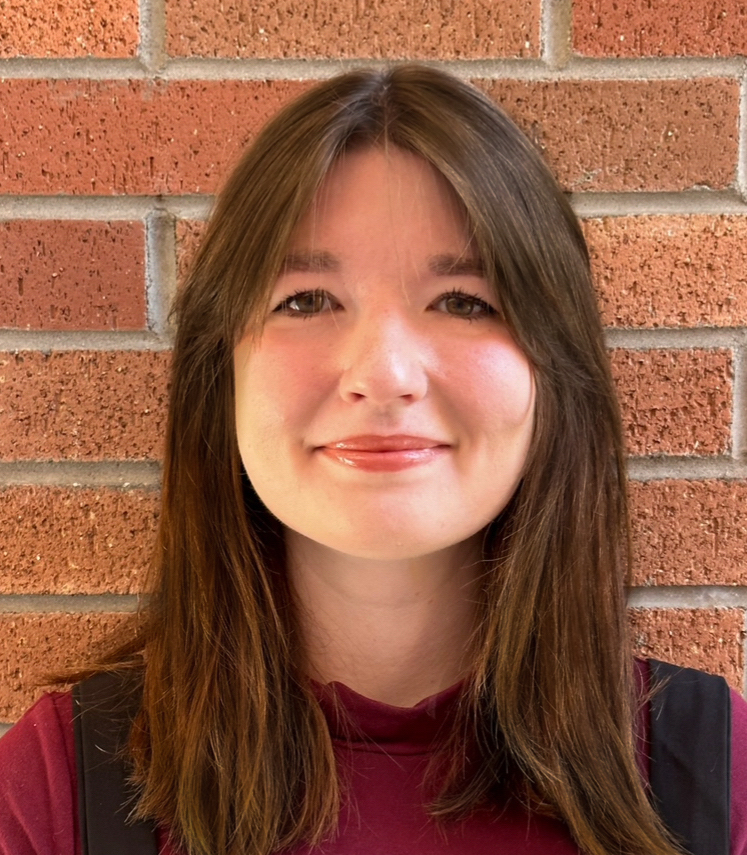

  

  
  <b> About </b>
  
Hi, I'm Libby and I'm a PhD Candidate and NSF Graduate Research Fellow at Arizona State University (ASU). I work in the [Low Frequency Cosmology (LoCo) Lab](loco.lab.asu.edu) on radio science instrumentation, focusing on instruments for high redshift cosmology and space mission telecommunications. 

