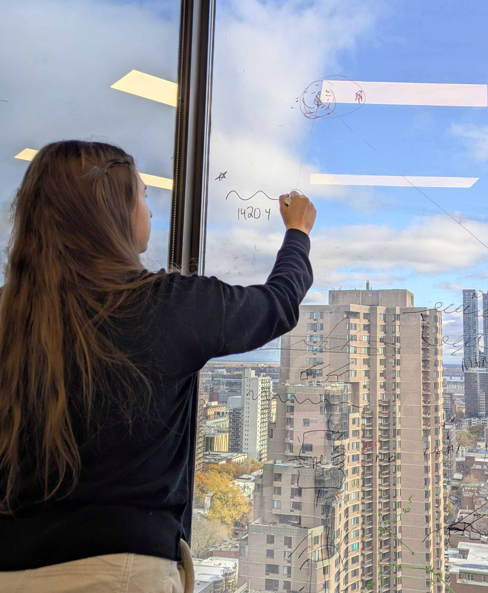

## About

Hi, I'm Libby Berkhout and I'm a Trottier Space Institute Postdoctoral Fellow at McGill University.
I build instruments that let us listen to the very early universe at radio wavelengths. My work sits at the intersection of radio astronomy and instrumentation. Currently I'm working on CHORD, a next-generation radio telescope at the Dominion Radio Astrophysical Observatory. <a href="/research"> Learn More here. →</a>

## Links

<a href="https://ui.adsabs.harvard.edu/search/q=orcid%3A0000-0002-2293-9639&sort=date+desc">NASA ADS</a> 
<a href="https://github.com/lmberkhout">Github</a> 
<a href="graphics/Curriculum_Vitae_2026.pdf">My CV</a> 

Contact me: <a href="mailto:libby.berkhout@mcgill.ca">libby.berkhout@mcgill.ca</a>

