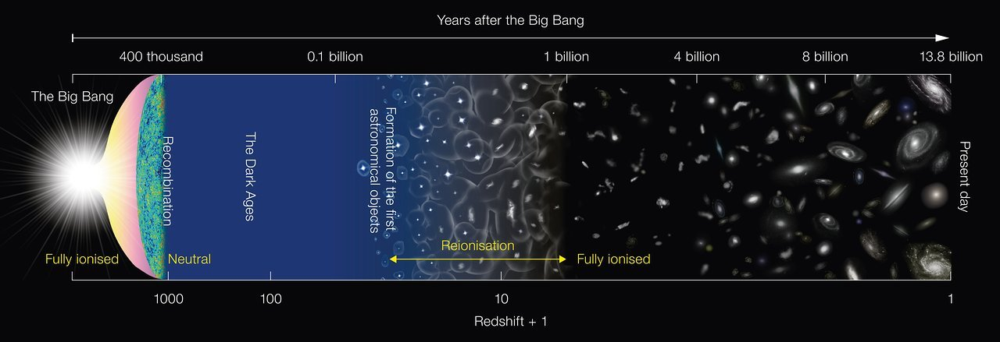
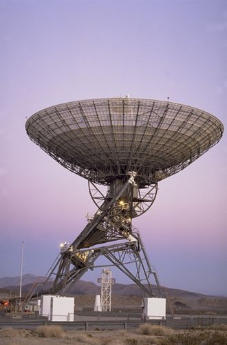
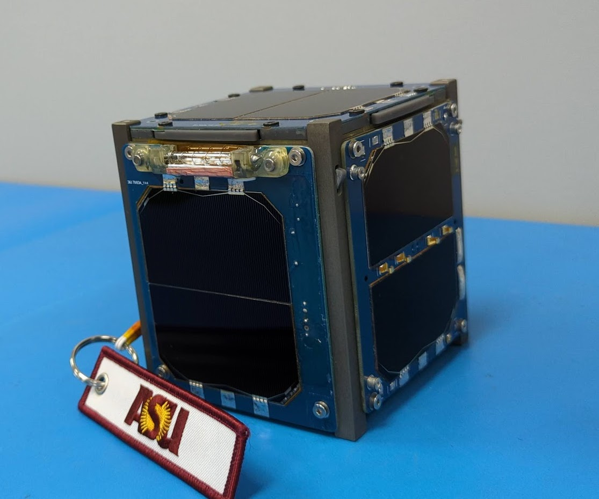

  <figure>
    

 <figcaption> <em> Cosmic ray monitors at Amundsen-Scott South Pole Station </em>  </figcaption>
    

  </figure>
 

 

  
  <b> Research </b>
 
My research largely focuses on radio science in the early universe, as well as a smattering of other radio instrumentation projects. I focus on instrument design and digital signal processing. This page is organized by project. 

  <figure>
     

 <figcaption> <em> An inside view of the HERA telescope </em>  </figcaption>
     

  </figure>
 

<b> <a href="reionization.org">The Hydrogen Epoch of Reionization Array (HERA) </a></b>  

HERA is an experiment targeting measurements of neutral hydrogen in the early universe. The Cosmic Microwave Background (CMB), or recombination, is the earliest radiation we can detect from the formation of the universe, marking the time when things have cooled off enough after the big bang to form into hydrogen. Then, the universe during the "dark ages" was primarily composed of neutral hydrogen. As this neutral hydrogen gravitationally collapsed, it began to form the earliest astronomical objects, kicking off "cosmic dawn". The radiation from these first objects ionized the surrounding hydrogen, causing the universe to transition from primarily neutral hydrogen to ionized hyrogen, which is the composition we see today. We call this the "Epoch of Reionization (EoR)". Neutral hydrogen emits in radio wavelengths, and by measuring this emission throughout reionization HERA traces the evolution of the universe. 

  <figure>
    

 <figcaption> <em> A timeline of the major cosmological epochs in the universe, from the big bang to modern day. Image via NAOJ/ NOAO. </em>  </figcaption>
  

  </figure>
  
 

  <figure>
    

    

 <figcaption> <em> A few views of a simulation of reionization from <a href="https://scholar.harvard.edu/julianbmunoz/eos-21"> the Evolution of 21-cm Structure </a> project. Panel (a) shows a 2 dimensional view of the strength of the 21-cm emission (produced my neutral hydrogen) as cosmic dawn and reionization progress. Panel (b) shows the globally averaged version of the simulation, as well as a single line of sight through cosmological redshift. Panel (c) shows the "foreground temperature", which is the emission in our local universe that occurs are the same frequencies as the 21-cm emission. These foregrounds are much stronger than the EoR signal, and must be removed or avoided for a detection. Panel (d) shows the expect power spectrum for a few different times in the universe. The power spectrum is the fundamental measurement HERA makes, which tells us how much power there is at certain size scales in our data. This will tell us the expected sizes of the ionized regions during the EoR and cosmic dawn. </em> </figcaption> 

  </figure>
  

  <figure>
    

    
 <figcaption> <em> The 34-meter Goldstone Apple Valley Radio Telescope. </em> </figcaption> 

  </figure>
  

<b> <a href="https://gavrt.lewiscenter.org/#">The Goldstone Apple Valley Radio Telescope (GAVRT)</a></b>  

The Goldstone Apple Valley Radio Telescope (GAVRT) program, a joint partnership between the Jet Propulsion Laboratory (JPL) and the Lewis Center for Education Research (LCER), operates a 34-meter retired DSN antenna as part of an outreach initiative. The program targets K-12 students to teach them about radio astronomy. Previous projects include targeted Jupiter observations, quasar variability, solar observations, SETI searches, and radio giant pulse observations. My project the ability to observe and decode transmissions from satellites and deep space missions.

<b> <a href="https://lightcube.space/">LightCube</a></b>  

  <figure>
    

   
 <figcaption> <em> The LightCube CubeSat on the lab bench </em> </figcaption> 
  

  </figure>
  

LightCube was a 1U educational CubeSat which had the goal of connecting the public with space by producing a flash visible to the naked eye on command by a public user. The spacecraft could be triggered via HAM radio communications by those with an amateur license. Lightcube deployed from the International Space Station on April 24th 2023 and operated for 24 hours before suffering a battery failure. During this time it was tracked by many amateurs around the world. Audio observations of the beacons were subsequently decoded by the student team and by amateurs. Having received many observations from around the world, the team has been able to reconstruct the sequence of events leading to loss of communications. I worked on the telemetry communications for the spacecraft. See a conference paper I wrote <a href="https://events.gnuradio.org/event/21/contributions/434/attachments/130/295/Demodulation_demonstration_using_the_LightCube_CubeSat.pdf"> here</a> and a talk I gave at GNURadioCon 2023 <a href="https://www.youtube.com/watch v=7144stK9Rmg&list=PLbBQHMnVMR41v81BfyV7RBZBDDttElW93&index=33">here</a>. 

