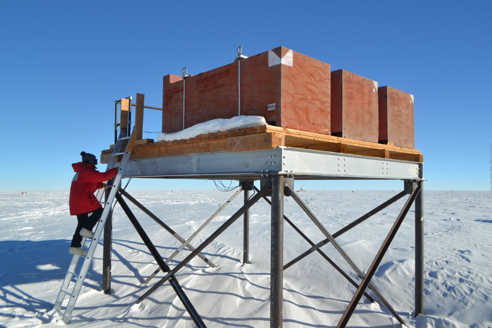
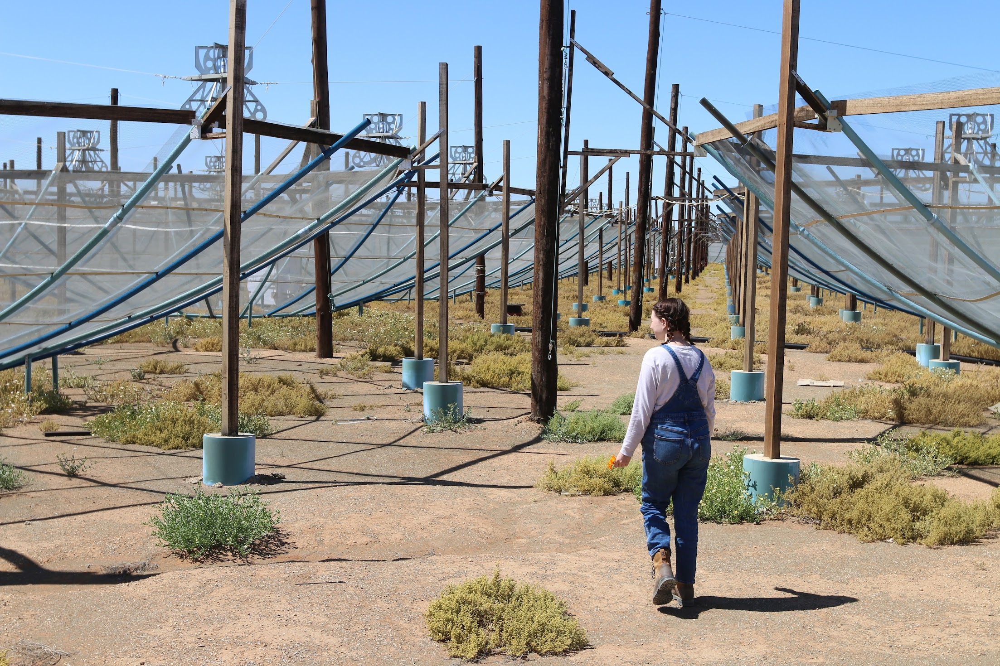

  <figure>

 <figcaption> Cosmic ray monitors at Amundsen-Scott South Pole Station </figcaption>

  </figure>
  

  
  <b> Research </b>
  
My research largely focuses on the radio science in the early universe, as well as a smattering of other radio instrumentation projects. I focus on instrument design and digital signal processing. 

  | *An inside view of the HERA telescope* |

  

<b> The Hydrogen Epoch of Reionization Array (HERA) </b>  
HERA is an experiment targeting measurements of neutral hydrogen in the early universe. 

