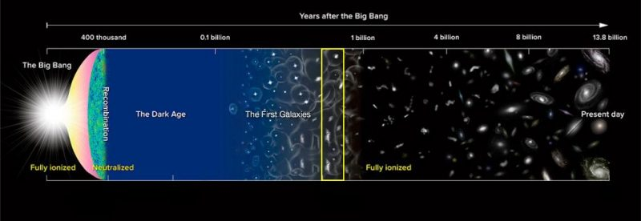
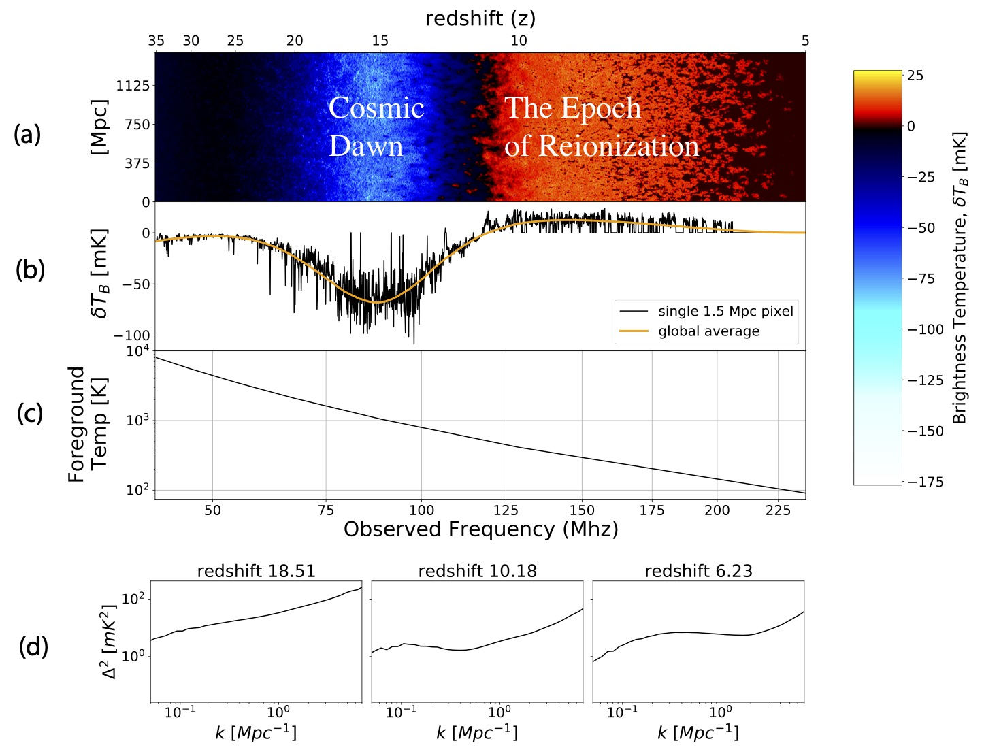

  <figure>

 <figcaption> <em> Cosmic ray monitors at Amundsen-Scott South Pole Station </em>  </figcaption>

  </figure>
 

 

  
  <b> Research </b>

 

 
My research largely focuses on radio science in the early universe, as well as a smattering of other radio instrumentation projects. I focus on instrument design and digital signal processing. This page is organized by project. 

  <figure>
     

 <figcaption> <em> An inside view of the HERA telescope </em>  </figcaption>
     

  </figure>
 

<b> The Hydrogen Epoch of Reionization Array (HERA) </b>  

HERA is an experiment targeting measurements of neutral hydrogen in the early universe. The Cosmic Microwave Background (CMB), or recombination, is the earliest radiation we can detect from the formation of the universe, marking the time when things have cooled off enough after the big bang to form into hydrogen. Then, the universe during the "dark ages" was primarily composed of neutral hydrogen. As this neutral hydrogen gravitationally collapsed, it began to form the earliest astronomical objects, kicking off "cosmic dawn". The radiation from these first objects ionized the surrounding hydrogen, causing the universe to transition from primarily neutral hydrogen to ionized hyrogen, which is the composition we see today. We call this the "Epoch of Reionization (EoR)". HERA traces the formation of the universe by measuring the locations of the neutral regions throughout reionization.

  <figure>

 <figcaption> <em> A timeline of the major cosmological epochs in the universe, from the big bang to modern day. Image via NAOJ/ NOAO. </em>  </figcaption>

  </figure>
  
 

  <figure>

 <figcaption> <em> </em>  </figcaption>

  </figure>
  

