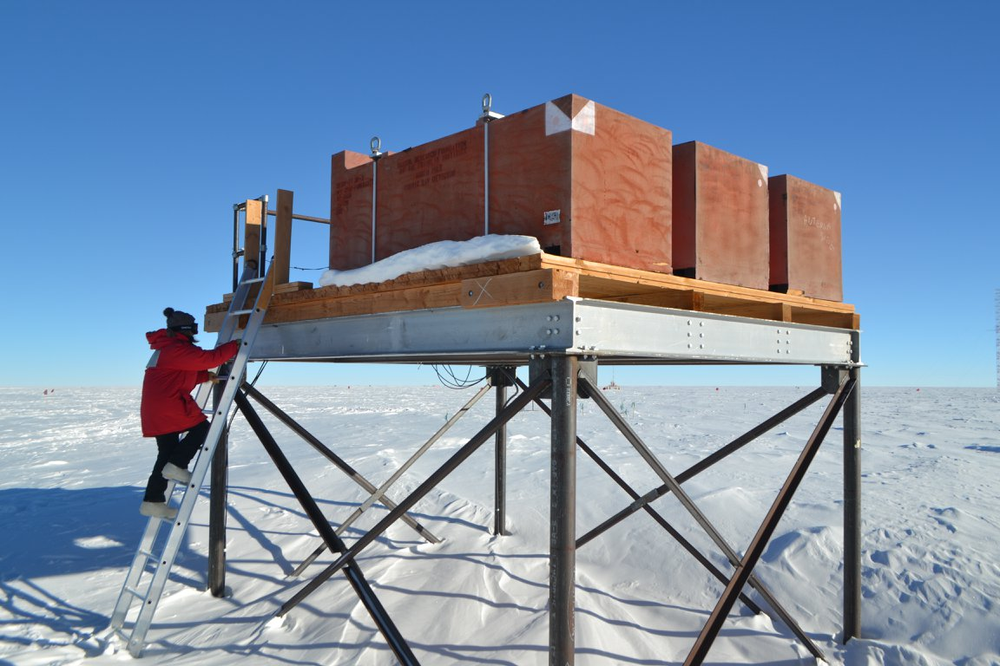
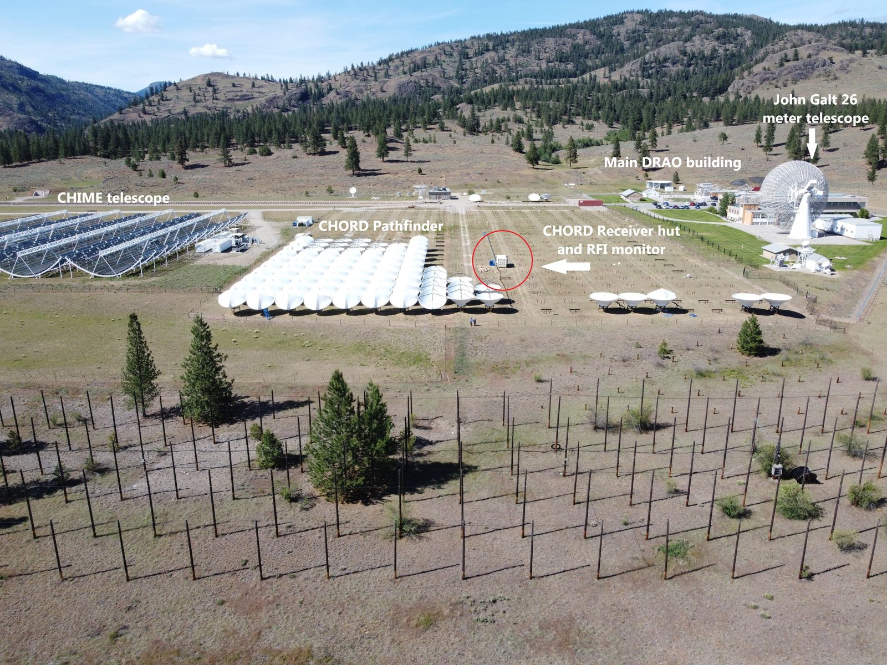
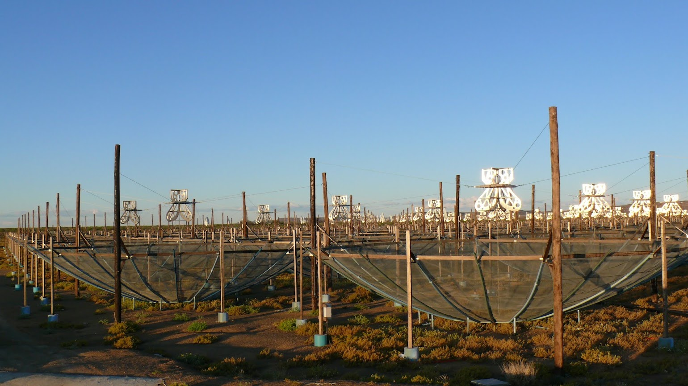
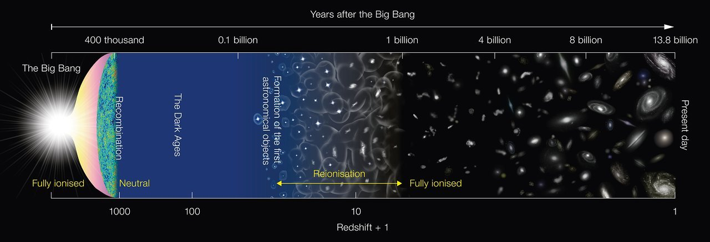
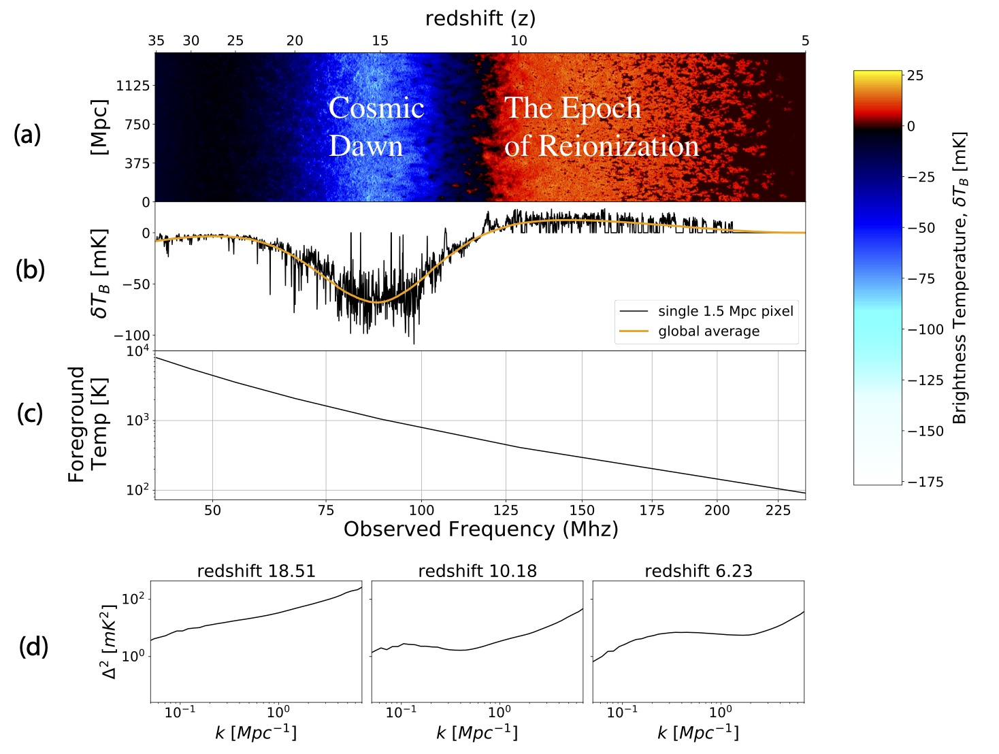
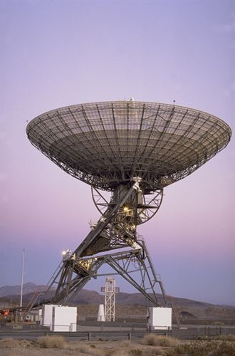
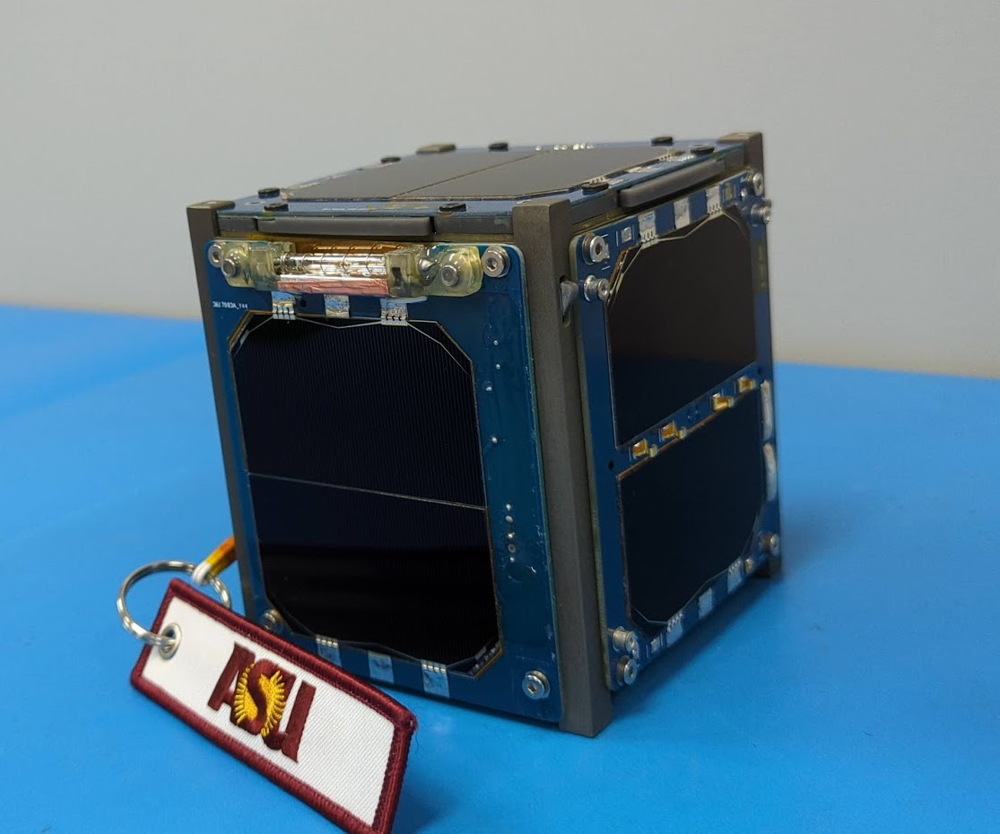

<section class="hero">
  <figure>
    
    <figcaption><em>My research in astronomy instrumentation takes me to a wide variety of locations, including as remote as the Amundsen-Scott South Pole Station.</em></figcaption>
  </figure>
</section>

<section class="intro">
  <h2>Research</h2>
  

    I build instruments that let us listen to the very early universe at radio wavelengths.
    My research sits at the intersection of radio astronomy and instrumentation, and focuses
    on the design, calibration, and commissioning of radio interferometers for 21-cm cosmology
    and transient astronomy, with an emphasis on instrumentation that improves data quality.
    My current work on the Canadian Hydrogen Observatory and Radio Transient Detector (CHORD)
    spans real-time radio-frequency interference (RFI) detection and mitigation, as well as
    the use of Global Navigation Satellite System (GNSS) satellites to map the beams of our
    telescopes. I also have prior instrumentation experience with the Hydrogen Epoch of
    Reionization Array, the Goldstone Apple Valley Radio Telescope Deep Space Network
    education telescope, and the LightCube CubeSat mission.
  

</section>

<section class="project">
  <h2>Canadian Hydrogen Observatory and Radio Transient Detector (CHORD)</h2>
  <figure>
    
    <figcaption><em>The CHORD pathfinder array with major landmarks identified. Image supplied by DRAO, HAA, the National Research Council of Canada.</em></figcaption>
  </figure>
  

    CHORD is a next-generation radio interferometer under construction at the Dominion Radio
    Astrophysical Observatory (DRAO) near Penticton. Its core array will consist of 512 six-meter
    dishes arranged in a highly redundant layout, operating across a 300&ndash;1500 MHz band, 
    The telescope is designed for precision 21-cm cosmology, fast radio
    burst discovery, pulsar science, and wide-field HI galaxy surveys. My work on CHORD focuses on
    real-time RFI detection and mitigation, and on using GNSS satellites to map and validate
    the telescope's beam response.
  

</section>

<section class="project">
  <h2><a href="reionization.org">The Hydrogen Epoch of Reionization Array (HERA)</a></h2>
  <figure>
    
    <figcaption><em>An inside view of the HERA telescope.</em></figcaption>
  </figure>
  

    HERA is an experiment targeting measurements of neutral hydrogen in the early universe.
    The Cosmic Microwave Background (CMB), or recombination, is the earliest radiation we can
    detect from the formation of the universe, marking the time when things cooled off enough
    after the Big Bang to form hydrogen. The universe during the following "dark ages" was
    primarily composed of neutral hydrogen. As this gravitationally collapsed, it began to
    form the earliest astronomical objects, kicking off "cosmic dawn." Radiation from these
    first objects ionized the surrounding hydrogen, transitioning the universe from mostly
    neutral to mostly ionized &mdash; the "Epoch of Reionization" (EoR). Neutral hydrogen emits
    at radio wavelengths, so by measuring this emission throughout reionization, HERA traces
    the evolution of the universe.
  

  <figure>
    
    <figcaption><em>A timeline of the major cosmological epochs in the universe, from the Big Bang to modern day. Image via NAOJ/NOAO.</em></figcaption>
  </figure>

  <figure>
    
    <figcaption><em>A few views of a simulation of reionization from <a href="https://scholar.harvard.edu/julianbmunoz/eos-21">the Evolution of 21-cm Structure</a> project. Panel (a) shows a 2D view of 21-cm emission strength as cosmic dawn and reionization progress. Panel (b) shows the globally averaged version, plus a single line of sight through cosmological redshift. Panel (c) shows the "foreground temperature" &mdash; local emission at the same frequencies as the 21-cm signal, which is much stronger and must be removed or avoided for a detection. Panel (d) shows the expected power spectrum at a few different times, telling us the expected sizes of ionized regions during the EoR and cosmic dawn.</em></figcaption>
  </figure>
</section>

<section class="project">
  <h2><a href="https://gavrt.lewiscenter.org/#">The Goldstone Apple Valley Radio Telescope (GAVRT)</a></h2>
  <figure>
    
    <figcaption><em>The 34-meter Goldstone Apple Valley Radio Telescope.</em></figcaption>
  </figure>
  

    The GAVRT program, a joint partnership between the Jet Propulsion Laboratory (JPL) and the
    Lewis Center for Education Research (LCER), operates a 34-meter retired DSN antenna as part
    of an outreach initiative. The program targets K-12 students to teach them about radio
    astronomy. Previous projects include targeted Jupiter observations, quasar variability,
    solar observations, SETI searches, and radio giant pulse observations. My project added the
    ability to observe and decode transmissions from satellites and deep space missions.
  

</section>

<section class="project">
  <h2><a href="https://lightcube.space/">LightCube</a></h2>
  <figure>
    
    <figcaption><em>The LightCube CubeSat on the lab bench.</em></figcaption>
  </figure>
  

    LightCube was a 1U educational CubeSat with the goal of connecting the public with space by
    producing a flash visible to the naked eye on command from a public user. The spacecraft
    could be triggered via HAM radio by those with an amateur license. LightCube deployed from
    the International Space Station on April 24th, 2023, and operated for 24 hours before
    suffering a battery failure. During that time it was tracked by many amateurs around the
    world; audio observations of the beacons were subsequently decoded by the student team and
    by amateurs. Having received many observations from around the world, the team was able to
    reconstruct the sequence of events leading to loss of communications. I worked on the
    telemetry communications for the spacecraft. See a conference paper I wrote
    <a href="https://events.gnuradio.org/event/21/contributions/434/attachments/130/295/Demodulation_demonstration_using_the_LightCube_CubeSat.pdf">here</a>
    and a talk I gave at GNURadioCon 2023
    <a href="https://www.youtube.com/watch?v=7144stK9Rmg&list=PLbBQHMnVMR41v81BfyV7RBZBDDttElW93&index=33">here</a>.
  

</section>

