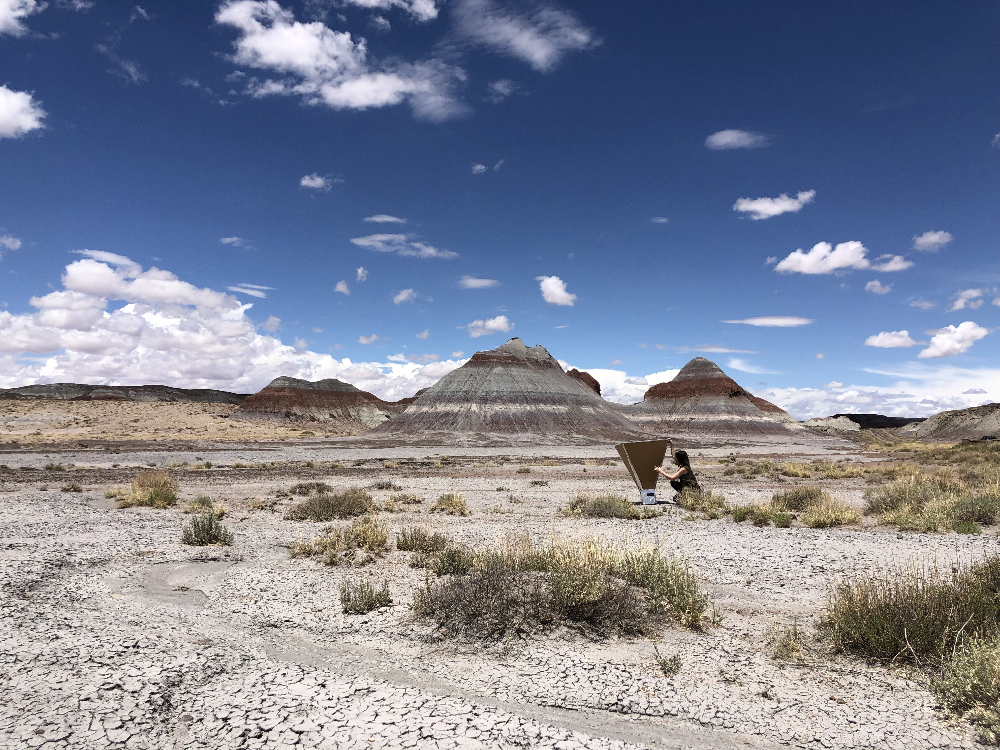

  

  
# Teaching

I am an advisor at ASU of the [Completely Hackable Amateur Radio Telescope (CHART)](astrochart.github.io) project, which is an outreach project targeted at high school students and teachers and led by undergraduate students. The project is currently a collaboration between Winona State University and Arizona State University, but we are always looking for interested folks. 

## Coursework 
 
<b>TA Spring 2024:</b>  
SESE 411: Senior Exploration Project II
  
<b>TA Fall 2023 :</b>
 
SESE 410: Senior Exploration Project I

