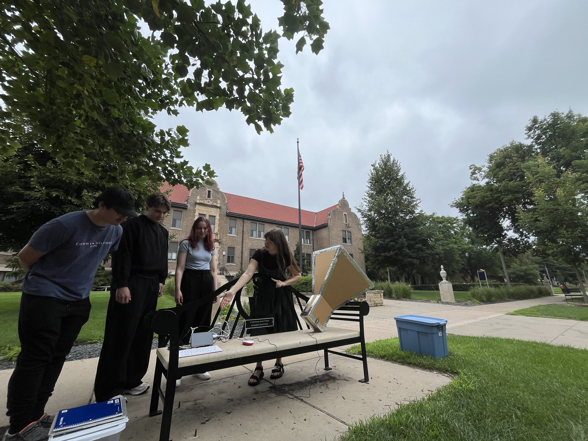

<b> <u>Teaching and Outreach</u> </b>

The [Completely Hackable Amateur Radio Telescope (CHART)](https://astrochart.github.io) project is an undergraduate-led outreach initiative that brings hands-on radio astronomy to the wider community. Participants build their own low-cost radio telescope using off the shelf components capable of detecting 21-cm hydrogen emission from the Milky Way. The project emphasizes accessibility-- all software, documentation, and tutorials are fully open source, and the total build cost is kept under $200 so it's approachable for classrooms. The project is suitable for students at the high school or undergraduate level, and has been successfully incorporated into classrooms at a number of institutions. CHART is a collaboration between Winona State University, McGill University, and Arizona State University, and we're always looking for new students, educators, or collaborators to get involved. To learn more please visit the linked website or contact me.

You can also read more in our published paper [here](https://iopscience.iop.org/article/10.1088/1361-6552/ad0542), or watch a talk I gave on the project at GNURadioCon 2023 [here](https://www.youtube.com/watch?v=LzkIl8sTvRY).

<b> Coursework </b>
 
<b>TA Spring 2024:</b>  
SESE 411: Senior Exploration Project II
  
<b>TA Fall 2023 :</b>
 
SESE 410: Senior Exploration Project I

